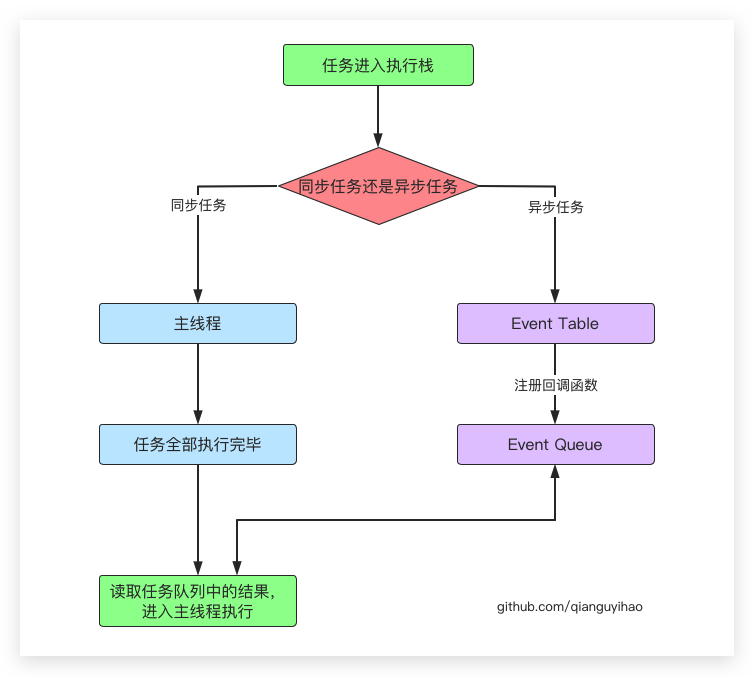

# JS异步

<!--more-->

JS作为浏览器的脚本语言，其执行环境是单线程。

具体来说，是JS引擎中负责解释和执行JS代码的线程只有一个，一次只能完成一项任务。所有的任务都需要排队。但JS引擎执行异步代码而不用等待，是因有为有消息队列和事件循环。

## 同步与异步

- **同步任务：**在**主线程**上排队执行的任务。只有前一个任务执行完成，才能执行下一个任务。
- **异步任务：**不进入主线程，而是进入**任务队列**的任务，该任务不会阻塞后面的任务执行。

**异步的使用场景：**

1. 事件监听（例如按钮绑定点击事件）
2. 回调函数：
   1. 定时器：setTimeout、setInterval
   2. ajax请求
   3. Node.js中的一些方法回调
3. ES6中的Promise、Generator、async/await

## JS的事件循环机制

JS主线程把执行栈的代码取出来依次执行。如果代码是同步的会放入**执行栈**主线程去执行；如果是异步则会放入`Event Table`中，当异步任务完成后会放入**事件队列**`Event Queue`中，这里面存储的是异步任务完成后做的事。等主线程把执行栈里的任务全部完成后，主线程空闲出来，这时才会读取异步队列`Event Queue`里面的函数，如果队列里有就取出来放到主线程去执行，执行完成后再查看事件队列`Event Queue`中是否还有异步任务，如果有继续执行。



注：异步调用的结果如果存在依赖，则需要通过回调函数进行嵌套

```js
console.log(1);

setTimeout(() => {
    console.log(2);
}, 0); // 即使等待事件为0，也要等到主线程任务完成才能执行异步任务
console.log(3);
console.log(4);
```

```
1
3
4
2
```

## 宏任务微任务

JS的异步任务又分为宏任务和微任务两种。宏任务是由宿主（浏览器、Node）发起的，而微任务由JS自身发起。

- **宏任务（macrotask）：**常见的定时器，用户交互事件等。如script（整体代码）、setTimeout、setInterval、UI渲染、I/O、postMessage、messageChannel、setImmediate（node.js环境）
- **微任务（microtask）：**如Promise、MutaionObserver、process.nextTick(node.js环境)

JS代码在执行时，首先执行同步任务，当同步任务执行完毕后，开始执行异步任务，异步任务执行时，首先按照代码的层级，同层级先执行微任务其次执行宏任务，以此类推。

