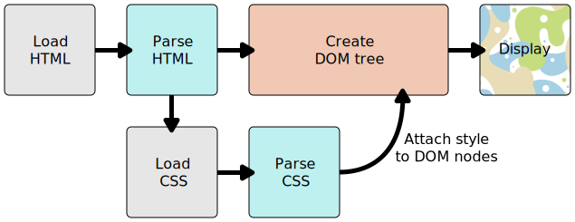

# CSS

<!--more-->

## CSS的渲染步骤

1. 浏览器载入HTML文件（比如从网络上获取）。
2. 将HTML文件转化成一个DOM（Document Object Model），DOM是文件在计算机内存中的表现形式，下一节将更加详细的解释DOM。
3. 接下来，浏览器会拉取该HTML相关的大部分资源，比如嵌入到页面的图片、视频和CSS样式。JavaScript则会稍后进行处理，简单起见，同时此节主讲CSS，所以这里对如何加载JavaScript不会展开叙述。
4. 浏览器拉取到CSS之后会进行解析，根据选择器的不同类型（比如element、class、id等等）把他们分到不同的“桶”中。浏览器基于它找到的不同的选择器，将不同的规则（基于选择器的规则，如元素选择器、类选择器、id选择器等）应用在对应的DOM的节点中，并添加节点依赖的样式（这个中间步骤称为渲染树）。
5. 上述的规则应用于渲染树之后，渲染树会依照应该出现的结构进行布局。
6. 网页展示在屏幕上（这一步被称为着色）。

## 选择器

### 基本选择器

| 选择器           | 示例      | 描述                                       |
| ---------------- | --------- | ------------------------------------------ |
| *                | *         | 选择所有元素                               |
| element          | div       | 选择所有div类型元素                        |
| .class           | .footer   | 选择所有class='footer'的元素               |
| #id              | #username | 选择所有id='username'的元素                |
| element, element | div, p    | 选择所有div和p类型元素                     |
| element>element  | div>p     | 选择所有父元素为div的所有p元素，不包括孙子 |
| element+element  | div+p     | 选择紧接在div后面的p元素                   |
| element~element  | p~ul      | 选择与p元素同级并在p后面的所有ul元素       |

### 伪类选择器

为元素的不同状态或为不确定存在的元素设置样式规则

| 状态                 | 示例                  | 说明                                       |
| -------------------- | --------------------- | ------------------------------------------ |
| :link                | a:link                | 选择所有未被访问的链接                     |
| :visited             | a:visited             | 选择所有已被访问的链接                     |
| :hover               | a:hover               | 鼠标移动到元素上时                         |
| :active              | a:active              | 点击正在发生时                             |
| :focus               | input::focus          | 选择获得焦点的 input 元素                  |
| :root                | :root                 | 选择文档的根元素即html。                   |
| :empty               | p:empty               | 选择没有子元素的每个元素（包括文本节点）。 |
| :first-child         | p:first-child         | 选择属于父元素的第一个子元素的每个元素     |
| :last-child          | p:last-child          | 选择属于其父元素最后一个子元素每个元素。   |
| :first-of-type       | p:first-of-type       | 选择属于其父元素的首个元素的每个元素       |
| :last-of-type        | p:last-of-type        | 选择属于其父元素的最后元素的每个元素。     |
| :only-of-type        | p:only-of-type        | 选择属于其父元素唯一的元素的每个元素。     |
| :only-child          | p:only-child          | 选择属于其父元素的唯一子元素的每个元素。   |
| :nth-child(n)        | p:nth-child(2)        | 选择属于其父元素的第二个子元素的每个元素。 |
| :nth-child(odd)      | p:nth-child(odd)      | 选择属于其父元素的奇数元素。               |
| :nth-child(even)     | p:nth-child(even)     | 选择属于其父元素的偶数元素。               |
| :nth-of-type(n)      | p:nth-of-type(2)      | 选择属于其父元素第二个元素的每个元素。     |
| :nth-last-child(n)   | p:nth-last-child(2)   | 同上，从最后一个子元素开始计数。           |
| :nth-last-of-type(n) | p:nth-last-of-type(2) | 同上，但是从最后一个子元素开始计数。       |
| :not(selector)       | :not(p)               | 选择非元素的每个元素                       |

css引入伪类和伪元素概念是为了格式化文档树以外的信息。也就是说：伪类和伪元素是用来修饰不在文档树中的部分。

伪类：用于已有元素处于某种状态时为其添加对应的样式，这个状态是根据用户行为而动态变化的。例如：当用户悬停在指定元素时，可以通过:hover来描述这个元素的状态，虽然它和一般css相似，可以为已有元素添加样式，但是它只有处于DOM树无法描述的状态下才能为元素添加样式，所以称为伪类。

伪元素：用于创建一些不在DOM树中的元素，并为其添加样式。例如，我们可以通过:before来在一个元素之前添加一些文本，并为这些文本添加样式，虽然用户可以看见这些文本，但是它实际上并不在DOM文档中。

**css3规范中要求使用双冒号（::）表示伪元素，以此来区分伪类和伪元素**，比如::before和::after等伪元素使用双冒号（::），:hover和:active伪类使用单冒号（:）。

## 盒子模型

## 浮动布局

## 定位布局

## 弹性布局

## 栅格系统
