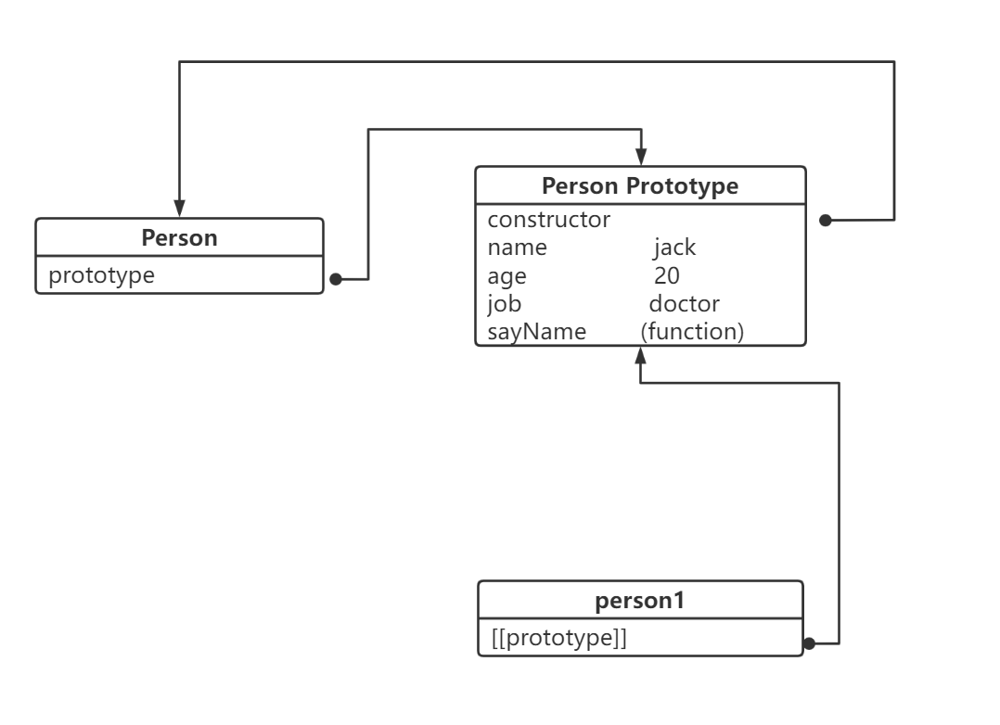

# 面向对象（一）——对象简介与创建

<!--more-->

JS中的面向对象，是基于**原型**的面向对象，依靠构造器（constructor）和原型（prototype）。

ES6中，引入了类（Class）和继承（Extend）来实现面向对象。

## 对象字面量

```js
const obj1 = {
    name: 'zr',
    age: 28
};
```

## 工厂模式

```js
function createPerson (name, age, job) {
    var o = new Object();
    o.name = name;
    o.age = age;
    o.job = job;
    o.sayName = function () {
        alert(this.name);
    };
    return o;
}

var person1 = createPerson('jack', 20, 'doctor');
```

使用工厂模式创建的对象，使用的构造函数都是Object，所以创建的对象都是Object类型，无法区分多种不同类型的对象。

## 构造函数模式

**构造函数：**是用来创建和初始化对象的特殊的函数，它与new一起使用才有意义。

```js
function Person(name, age, job) {
    this.name = name;
    this.age = age;
    this.job = job;
    this.sayName = function () {
        alert(this.name);
    };// 不需要return对象
}

var person1 = new Person('zr', 20, 'student');
var person2 = new Person('jack', 30, 'doctor');

// 所有对象均继承自Object
alert(person1 instanceof Object); // true
alert(person1 instanceof Person); // true
```

**不同函数this的指向：**

- 以函数的形式调用时，this永远指向window。
- 以方法的形式调用时，this指向调用方法的对象。
- 以构造函数形式调用时，this指向新创建的实例对象。

**构造函数的问题：**

每个方法都要在每个实例上重新创建一遍。不同实例上的同名函数时不相等的。按照上面这种写法，假设创建10000个对象实例，就会创建10000个 sayName 方法。这种写法肯定是不合适的。我们为何不让所有的对象共享同一个方法呢？

还有一种方式是，将sayName方法在全局作用域中定义：（不建议。原因看注释）

```js
function Person(name, age, gender) {
    this.name = name;
    this.age = age;
    this.gender = gender;
    //向对象中添加一个方法
    this.sayName = fun;
}

//将sayName方法在全局作用域中定义
/*
 * 将函数定义在全局作用域，污染了全局作用域的命名空间
 *  而且定义在全局作用域中也很不安全
 */
function fun() {
    alert("Hello大家好，我是:" + this.name);
};
```

### 原型模式

#### 原型对象

每个创建的函数都有一个prototype（原型）属性，这个属性是一个指针，指向一个对象，这个对象包含了通过调用该构造函数所创建的对象共享的属性和方法。运行机制如下：

1. 创建一个自定义的构造函数后，其原型对象默认只有constructor（构造函数）属性（指向prototype属性所在函数的指针）。
2. 调用构造函数创建一个新实例，实例内部将包含一个指针指向构造函数的原型对象。ES5中称这个指针为`[[prototype]]`，Firefox、Safari和Chrome在每个对象上都支持一个属性`__proto__`。



如上图所示，person1实例不包含属性和方法，但它仍可以调用到它的原型对象的属性和方法，这是通过查找对象属性的过程实现的。

每当代码读取某个对象的某个属性时，都会执行一次搜索，搜索首先从对象实例本身开始。如果在实例中找到了具有给定名字的属性，则返回该属性的值；如果没有找到，则继续搜索指针指向的原型对象。

虽然可以通过对象实例访问保存在原型中的值，**但不能通过对象实例重写原型中的值。**

即使将实例的同名属性设为null，也只会在实例中设置这个属性。使用delete操作符可以完全删除实例属性，从而重新访问原型中的同名属性。

**一些方法：**

- isPrototypeOf()  确定是否是实例对象的原型对象
- Object.getPrototypeOf()  返回对象的原型对象
- hasOwnProperty()  检测一个属性是存在于实例中，还是存在原型中。存在对象实例中返回true。

#### in操作符

**单独使用：**检查对象中是否含有某个属性，无论是在实例对象还是在其原型对象。

**for-in：**返回所有能通过对象访问的、可枚举的（enumerated）属性。

#### 更简单的原型语法

前面的例子中每添加一个属性和方法都要用`Person.prototype`。为简化操作，更常见的做法是用一个包含所有属性和方法的对象字面量来重写整个原型对象。

```js
function Person() {
}
Person.prototype = {
	name: 'jack',
	age: 20,
	job: 'doctor',
	sayName: function() {
		alert(this.name);
	}
};
```

#### 原型的动态性

#### 原生对象的原型

原型模式不仅体现在创建自定义类型方面，也体现在原生的引用类型。但不建议修改原生对象的原型。

## 组合使用构造函数模式和原型模式

构造函数模式用于定义实例属性，原型模式用于定义方法和共享的属性。

```js
function Person(name, age, job) {
  this.name = name;
  this.age = age;
  this.job = job;
  this.frieds = ['jack', 'zr'];
}

Person.prototype = {
  constructor: Person,
  sayName: function() {
    alert(this.name);
  }
};

var person1 = new Person('Nick', 23, 'doctor');
var person2 = new Person('Grey', 32, 'Engineer');

person1.frieds.push('Van');
console.log(person1.frieds); // [ 'jack', 'zr', 'Van' ]
console.log(person2.frieds); // [ 'jack', 'zr' ]
console.log(person1.frieds === person2.frieds); // false
console.log(person1.sayName === person2.sayName); //true
```

## 动态原型模式

```js
function Person(name, age, job) {
  this.name = name;
  this.age = age;
  this.job = job;
  if (typeof this.sayName != 'function') {
    Person.prototype.sayName = function () {
      console.log(this.name);
    }
  }
}

var friend = new Person('Nick', 29, 'Engineer');
friend.sayName();
```

这里只会在`sayName()`方法不存在的情况下，才会将它添加到原型中。
