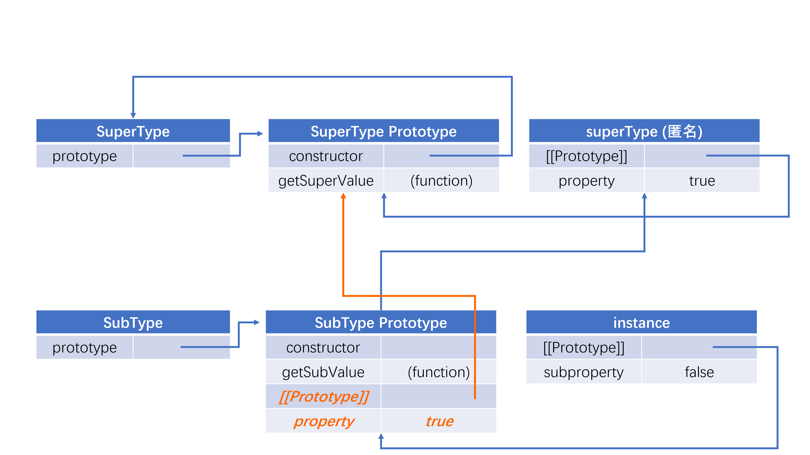
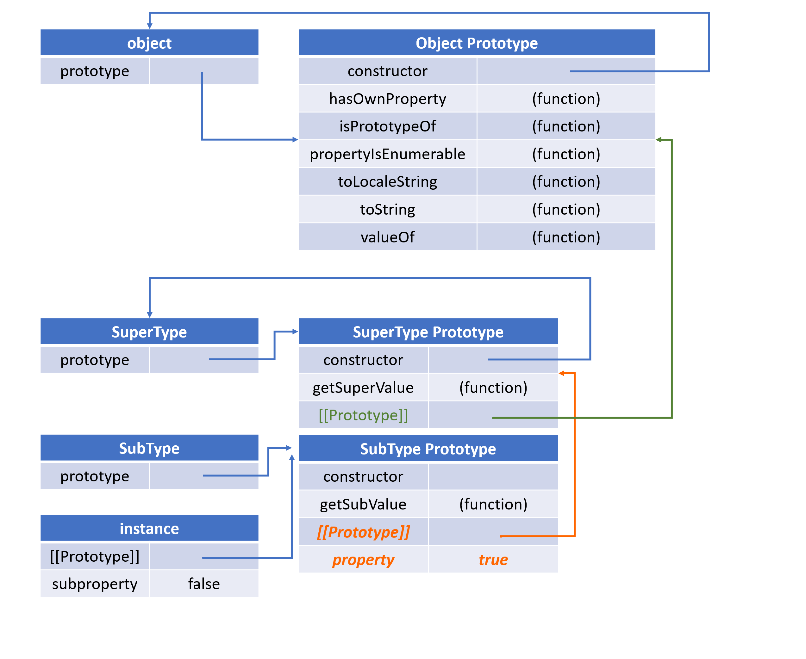

**面向对象（二）——继承**

<!--more-->

在众多OO语言中支持两种继承方式：接口继承和实现继承。接口继承只继承方法签名，而实现继承则继承实际的方法。由于JS函数没有签名，无法实现接口继承，只能支持实现继承。

# 原型链

ES将原型链作为实现继承的主要方法。其基本思想是：利用原型让一个引用类型继承另一个引用类型的属性和方法。

每个构造函数都有一个由prototype属性指向的原型对象，原型对象包含一个指向构造函数的指针constructor，而实例都包含一个指向原型的内部指针[[prototype]]。

实现原型链有一种基本模式，代码如下：

```js
function SuperType() {
  this.property = true;
}

SuperType.prototype.getSuperValue = function() {
  return this.property;
};

function SubType(){
  this.subproperty = false;
}

SubType.prototype = new SuperType();

SubType.prototype.getSubValue = function() {
  return this.subproperty;
};

var instance = new SubType();
console.log(instance.getSuperValue());
```

这段代码的原型链图如下所示：



由于SubType的原型等于了SuperType的实例对象，等价于SubType的原型指向SuperType的原型。SubType继承了SuperType，而继承是通过创建SuperType的实例，并将该实例附给SubType的原型实现的。换句话说，原来存在SupeType的实例中的属性和方法，现在也存在于SubType的原型中了。

**别忘了默认的原型**

所有引用类型默认都继承了Object，而这个继承也是通过原型链实现的。


