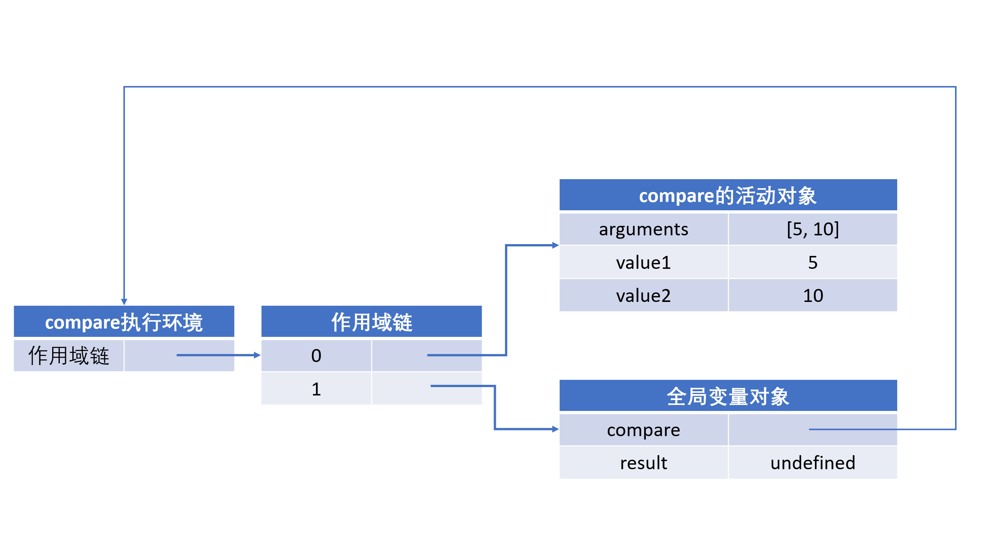

# 函数表达式（一）——闭包

<!--more-->

## 递归

递归函数是在一个函数通过名字调用自身的情况下构成的，如前篇说过的阶乘函数：

```js
function factorial(num) {
  if (num < 1) {
    return 1;
  } else {
    return num * factorial(num - 1);
  }
}
```

这里在函数内调用自身函数名可以使用`arguments.callee`，指向正在执行函数的指针代替。

但在严格模式下，不能通过脚本访问`arguments.callee`，可以使用**命名函数表达式**来达成同样效果。

```js
var factorial = (function f(num) {
  if (num < 1) {
    return 1;
  } else {
    return num * f(num - 1);
  }
});
```

## 闭包

闭包是指有权访问另一个函数作用域中的变量的函数。

JS中变量的作用域无非两种，全局变量和局部变量。JS可以在函数内部直接读取全局变量。如何实现在全局作用域中访问到函数内的局部变量呢？就是使用JS作用域链的特性以达到该目的。

个人理解JS的闭包的作用类似JAVA中的封装，数据使用private修饰符修饰类属性被保护在类的内部，尽可能隐藏内部细节，只保留外部接口getter、setter访问。不完全对，较为浅显。

### 作用域链

作用域里面嵌套作用域，就形成了作用域链。

当某个函数被调用时，会创建一个执行环境（执行上下文）以及相应的作用域链。

每个执行环境都有一个表示变量的对象——**变量对象**。一个新的执行环境的声明周期可以分为两个阶段。

- **代码编译阶段**

  在这个阶段中，执行环境会分别创建变量对象，建立作用域，以及确定this的指向。

- **代码执行阶段**

  创建完成之后，就会开始执行代码，这时会完成变量赋值，函数引用，以及执行其他代码。

在函数执行过程中，为读取和写入变量的值，需要在作用域链中查找变量

```js
function compare(value1, value2) {
  if (value1 > value2) {
    return -1;
  } else if (value1 > value2) {
    return 1;
  } else {
    return 0;
  }
}

var result = compare(5, 10);
```

当调用compare函数时，会将其执行环境中的变量对象转化为活动对象，其作用域链如图



作用域链本质上是一个指向变量对象的指针列表，它只引用但不实际包含变量对象。

### 变量对象

变量对象的创建，依次经历以下步骤。

1. 建立arguments对象。检查当前上下文中的参数，建立该对象下的属性与属性值。
2. 检查当前上下文的函数声明，即用function关键字声明的函数。在变量对象中以函数名建立一个属性，属性值为指向该函数所在内存地址的引用。如果函数名的属性已经存在，那么该属性将会被新的引用所覆盖。
3. 检查当前上下文中的变量声明，每找到一个变量声明，就在变量对象中以变量名建立一个属性，属性值为undefined。如果该变量名的属性已经存在，为了防止同名的函数被修改为undefined，则会直接跳过，原属性值不会被修改。

从上面的规则可以看出，function声明会比var声明优先级更高一点。

下面用一个例子来理解变量对象（Variable Object, OV）的创建和活动对象（Activate Object, AO）的转化

```js
function test() {
  console.log(a);
  console.log(foo());

  var a = 1;
  function foo() {
    return 2;
  }
}

test();
```

```js
// 创建阶段
VO = {
	arguments: {...},
 	foo: <foo reference>, // foo地址引用
	a: undefined
}
```

未进入执行阶段前，变量对象中的属性都不能访问。但进入执行阶段后，变量对象转变成了活动对象，里面的属性都能被访问了，然后开始进入执行阶段的操作。

> Q：变量对象和活动对象的区别？
>
> A：它们都是同一个对象，只是处在执行的不同生命周期。

```js
// 执行阶段
// VO -> AO
AO = {
  arguments: {...},
  foo: <foo reference>,
  a: 1
}
```

此时，上面的例子，执行顺序就变成了这样

```js
function test() {
  function foo() {
    return 2;
  }
  var a;
  console.log(a);
  console.log(foo());
  a = 1;
}
```


#### 执行上下文

JS中可执行的代码类型有三种：

- **全局代码：**外部js文件或者本地标签内的代码，全局代码不包括function体内的代码。
- **函数代码：**function体内的代码。
- **eval代码：**eval()函数计算某个字符串，并执行其中的代码。

当JS引擎遇到这三种代码，分为两个阶段，**代码编译阶段**和**代码执行阶段**。编译阶段由编译器完成，将代码编译成为可执行代码，这个阶段**作用域**规则会确定。执行阶段由引擎完成，主要任务是执行可执行代码，**执行上下文**在这个阶段创建。

> JS引擎，不是逐条解释js代码，而是按照代码块一段段解释执行。所谓代码块是使用`<script>`标签分隔的代码段。
>
> 对于常见编译型语言（Java等），编译步骤为：词法分析->语法分析->语义检查->代码优化和字节生成
>
> 对于解释型语言（JavaScript等），通过词法分析和语法分析得到语法树后，就可以开始解释执行了。

### 闭包的实现

一般来说，当函数执行完毕后，局部活动对象就会被销毁，内存中仅保存全局作用域（全局执行环境的变量对象）。但是，闭包的情况有所不同。

```js
function player() {
  var life = 3;
  function lose_life() {
    life--;
    console.log(life);
  }
  return lose_life;
}

var mario = player();
mario(); // 2
```

这个例子中，函数lose_life被包括在函数player内部，player内部所有局部变量对lose_life都是可见的。既然如此，把lose_life作为返回值，就可以在player外部读取它的内部变量了。

**闭包的用途**

- 可以读取到函数内部的变量
- 让函数内部的变量始终保持在内存中

```js
function player() {
  var life = 3;
  loss_life = function () {
    life--;
  }
  function show_life() {
    console.log(life);
  }
  return show_life;
}

var mario = player();
mario(); // 3
loss_life();
mario(); // 2
```

可以看到，player函数在运行一次后，局部变量life并没有被删除。原因是player是show_life的父函数，而show_life被赋给了一个全局变量mario，这导致show_life始终在内存中，而show_life的存在依赖于player，因此player也是种在内存中，不会在调用结束后，被垃圾回收机制删除。

### 闭包与作用域链

```js
function createComparisonFunc(propertyName) {
  return function (obj1, obj2) {
    var value1 = obj1[propertyName];
    var value2 = obj2[propertyName];

    if (value1 > value2) {
      return -1;
    } else if (value1 < value2) {
      return 1;
    } else {
      return 0;
    }
  };
}

var compare = createComparisonFunc('name');
var result = compare({name: 'Nick'}, {name: 'Jack'});
compare = null; // 解除对匿名函数的引用（释放内存）
```

当`createComparisonFunc()`函数返回后，其执行环境的作用域链会被销毁，但它的活动对象仍然会留在内存中；直到匿名函数被销毁后，`createComparisonFunc()`的活动对象才会被销毁。

### 使用闭包的注意点

由于闭包会使得函数中的变量始终被保存在内存中，所以不能滥用闭包，否则会出现性能问题。解决方法是，在推出函数之前，将不使用的局部变量全部删除。

闭包会在父函数外部，改变父函数内部变量的值。如果你把父函数当作对象（object）使用，把闭包当作它的公用方法（Public Method），把内部变量当作它的私有属性（private value），这时一定要小心，不要随便更改父函数内部变量的值。
