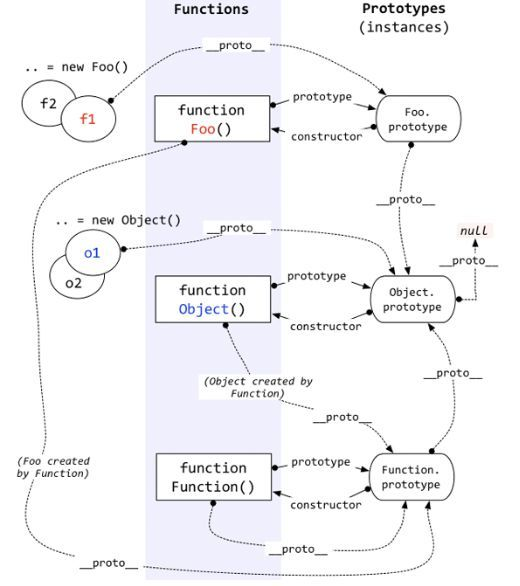
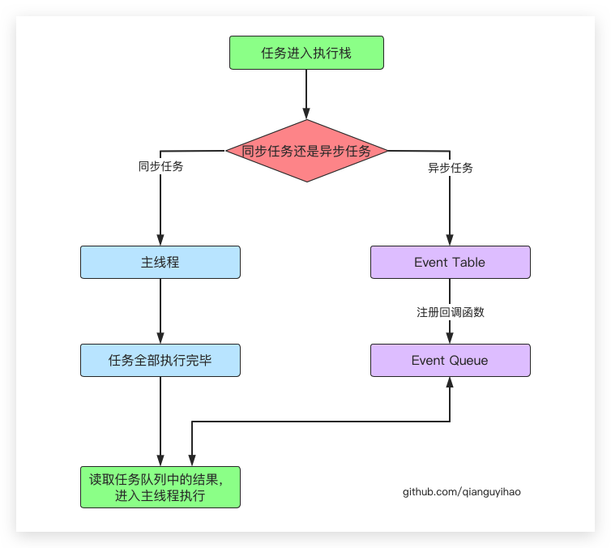
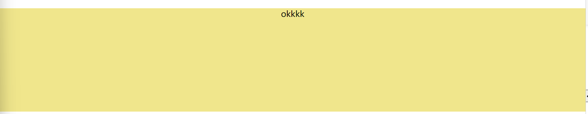
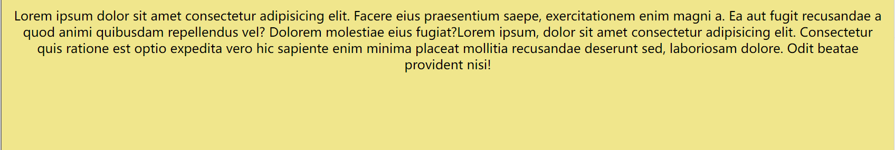
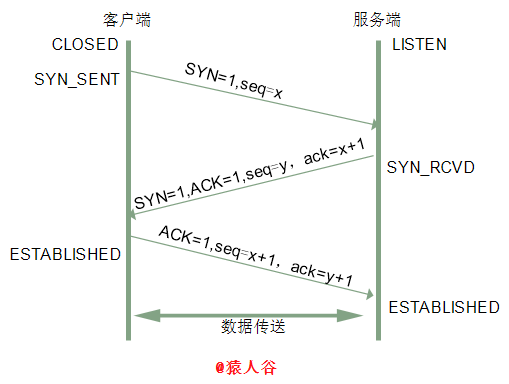
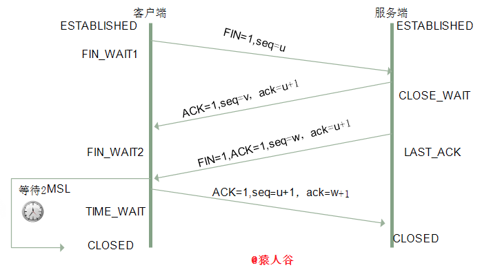
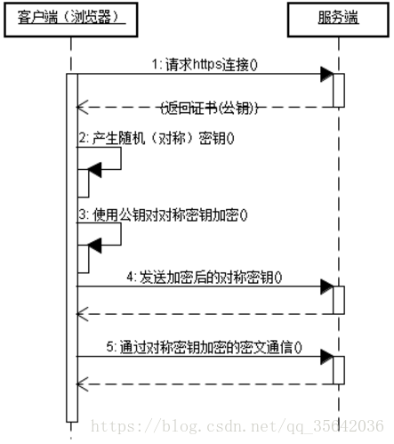

<!--more-->

# 前端面试汇总

## JS部分

### 1.作用域与作用域链

一段程序中用到的名字，限制名字可用性的代码范围就是这个名字的作用域scope。JS的作用域为静态作用域，也可称词法作用域。JS常用的作用域有函数作用域，块级作用域let，const。

作用域链，由多级作用域连续引用的链式结果，先在局部作用域找，如果每找到再向父级作用域找。

### 2.原型与原型链



### 3.js的事件异步单线程



JS的异步任务又分为宏任务和微任务两种。宏任务是由宿主（浏览器、Node）发起的，而微任务由JS自身发起。

- **宏任务（macrotask）：**常见的定时器，用户交互事件等。如script（整体代码）、setTimeout、setInterval、UI渲染、I/O、postMessage、messageChannel、setImmediate（node.js环境）
- **微任务（microtask）：**如Promise、MutaionObserver、process.nextTick(node.js环境)

JS代码在执行时，首先执行同步任务，当同步任务执行完毕后，开始执行异步任务，异步任务执行时，首先按照代码的层级，同层级先执行微任务其次执行宏任务，以此类推。

**Event Loop**


### 4.浏览器DOM渲染及阻塞问题

- 阻塞型：
  - 内联JS
  - 外联普通JS
  - 外联defer属性JS
  - 内联CSS
  - script标签之前的外联CSS

- 非阻塞型：
  - 外联sync属性JS
  - img标签
  - iframe
  - script标签后的外联css

### 5. new关键字与Object.create()的区别

```js
// new 关键字 const a = new Foo();
let o = new Object();
o.__proto__ = Foo.prototype;
Foo.call(o);
a = o;


// Object.create() a = Object.create(old);
Object.myCreate = function(obj) {
  function F(){};
  F.prototype = obj;
  return new F();
}
```

### 6. typeof和instance of

typeof用于检测数据类型，对象、数组、null返回值是object，函数返回值是function，undefined返回值是undefined。

instanceof本意是用来判断A是否是B的实例对象，其检测的是原型。如下面的例子

```js
console.log([] instanceof Array); // true
console.log([] instanceof Object); // true
```

### 7.Ajax

Asynchronous JavaScript And XML（异步Javascript和XML）。

核心是`XMLHttpRequest`对象，可以使用XHR对象取得新数据，然后再通过DOM将新数据插入到页面中。

一个Ajax请求的步骤：

1. 创建异步对象，即XMLHttpRequest对象
2. 使用open方法设置请求参数。`open(method, url, async)`
3. 发送请求。`send()`
4. 注册事件，注册`onreadystatechange`事件，状态改变时就会调用。
5. 服务端响应，获取返回的数据

```js
// 创建XMLHttpRequest对象
let xmlHttp = new XMLHttpRequest();

// 设置请求的参数，调用open只是启动一个请求以备发送
// 第三个参数true（异步），false（同步）
xmlHttp.open('get', 'test.php', false);

// 发送请求，sned方法接收一个参数，要作为请求主体发送的数据，若不需要通过请求主体发送数据，
// 则必须传入null
xmlHttp.send(null);

// 注册事件
xmlHttp.onreadystatechange = function () {
  if (xmlHttp.readyState == 4 && xmlHttp.status === 200) {
    console.log('success' + JSON.stringify(xmlhttp.responseText));
  }
};
```

在收到响应后，响应的数据会自动填充XHR对象的属性：

- **responseText：**作为响应主体被返回的文本
- **responseXML：**如果响应的内容类型是"text/xml"或"application/xml"，这个属性中将保存包含响应数据的XML DOM文档。
- **status：**响应的HTTP状态
- **statusText：**HTTP状态的说明

**readyState属性**

多数情况下，我们还是要发送异步请求。此时可以检测XHR对象的readyState属性，该属性表示请求和响应过程中的当前活动阶段。这个属性的值如下：

- **0：**未初始化，尚未调用open()方法
- **1：**启动，已经调用open()方法，但尚未调用send()方法
- **2：**发送，已经调用send()方法，但尚未接收到响应
- **3：**接收，已经接收到部分响应数据
- **4：**完成，已经接收到全部的响应数据，已经可以在客户端使用了

每次readyState属性值发生变动，都会触发一次readystatechange事件。

### 8.Promise

**Promise对象的三个状态**

- 初始化（等待中）：pending
- 成功：fulfilled
- 失败：rejected

**Promise处理失败的写法**

1. 通过catch方法统一捕获状态变为reject的promise，在promise链中，只要有一个请求失败，就直接执行catch()。
2. then可以传递两个参数，第一个参数为resolve后执行，第二个参数为reject后执行，这种写法不影响promise链的执行。

### 9.async / await

本质是Generator的语法糖

 async返回Promise实例对象，await得到异步结果。

await等待的是一个表达式，这个表达式可以是Promise对象或者其他值。（也即没有特殊限定一定是等待async）。

如果等到的不是一个Promise对象，await运算结果就是它等到的量。

如果等到的是一个Promise对象，它会阻塞后面的代码，等待Promise对象resolve，然后得到resolve的值，作为await表达式的运算结果。（这就是await必须用在async函数内部的原因，async函数调用不会造成阻塞，它内部所有的阻塞都被封装在一个Promise对象中异步执行。）

### 10.对象的内部属性和方法

### 11.模块化


## HTML部分

### 标签语义化

HTML 标签语义化是让大家直观的认识标签(markup)和属性(attribute)的用途和作用。

如`<header>`，`<footer>`，`<article>`，`<section>`

## CSS部分

### 1.css元素权重

| 行内样式    | 1000 |
| :---------- | ---- |
| ID选择器    | 0100 |
| class选择器 | 0010 |
| 标签、伪类  | 0001 |
| *           | 0000 |

### 2.position定位属性

- **static：**默认正常流
- **absolute：**完全脱标，完全不占位置，父类要有定位（relative，absolute，fixed），若没有则以Document文档定位
- **relative：**相对于其在标准流中的位置，不脱标，占据原来位置
- **fixed：**完全脱标，完全不占位置，只认浏览器的可视窗口
- **sticky：**根据正常文档流定位，不脱标

### 3.display属性

- **inline：**行内元素
- **block：**块级元素
- **inline-block：**行内块元素
- **flex：**弹性盒，单轴
- **grid：**网格，双轴

### 4.浮动属性

相邻浮动的块元素可以并在一行，超出父级宽度就换行。*浮动让行内元素或块元素转化为行内块元素（不确定）。*

高度塌陷：父元素如果没有设置尺寸，父元素内整体浮动的元素无法撑开父元素，父元素需要清除浮动。

1. 在父元素内部最后添加一个没有高度的元素，设置clear: both;
2. 使用::after伪类为父元素添加后标签
3. 通过对父元素设置overflow属性，使父元素形成BFC，父元素高度计算会包括浮动元素的高度。

### 6.圣杯与双飞翼布局

两种布局都是三栏布局，两边固定宽度，中间自适应，中间栏要放在文挡流前面以优先渲染。

**圣杯布局**

首先设置三栏浮动，设置中间div宽度100%，左右div被挤到后一行。此时给中间div设置左右padding以便给左右div留出位置。为了让左div回到上一行，设置其position为relative并margin-left设为-100%，再添加left: -300px使其回到第一行最左侧。同理，右div设置position为relative并margin-left：-200px，right：-200px。

**双飞翼布局**

中间的div多了一个子容器，通过控制其子容器的margin或padding空出左右两列的宽度。

### 7.居中问题

**水平居中**

行内元素一行文字

```css
    .content {
      height: 200px;
      background-color: khaki;
      text-align: center;
    }
```

```html
  <div class="content">
    <p>okkkk</p>
  </div>
```



行内元素多行文字

```css
    .content p {
      padding: 10px;
      margin: 0;
    }
```

```html
  <div class="content">
    <p>Lorem ipsum dolor sit amet consectetur adipisicing elit. Facere eius praesentium saepe, exercitationem enim magni
      a. Ea aut fugit recusandae a quod animi quibusdam repellendus vel? Dolorem molestiae eius fugiat?Lorem ipsum,
      dolor sit amet consectetur adipisicing elit. Consectetur quis ratione est optio expedita vero hic sapiente enim
      minima placeat mollitia recusandae deserunt sed, laboriosam dolore. Odit beatae provident nisi!</p>
  </div>
```



块级元素方法一

```css
    .inner {
      background-color: coral;
      height: 100px;
      width: 100px;
      margin: 0 auto;
    }
```

```html
  <div class="content">
    <div class="inner"></div>
  </div>
```

块级元素方法二

先将父元素设置为相对定位，再将子元素设置为绝对定位，向右移动子元素，移动距离为父容器的一半，最后通过向左移动子元素的一半宽度以达到水平居中。

```css
    .content {
      height: 200px;
      background-color: khaki;
      position: relative;
    }

    .inner {
      background-color: coral;
      height: 100px;
      width: 100px;
      position: absolute;
      left: 50%;
      transform: translateX(-50%);
    }
```

块级元素方法三

通过CSS3中的布局利器flex中的justify-content属性来达到水平居中。

```css
    .content {
      height: 200px;
      background-color: khaki;
      justify-content: center;
      display: flex;
    }
```

块级元素方法四

通过flex将父容器设置为为Flex布局，再设置子元素居中。

```css
    .content {
      height: 200px;
      background-color: khaki;
      display: flex;
    }
    
    .inner {
      margin: 0 auto;
    }
```

**垂直居中**

单行行内元素

```css
    .content {
      height: 200px;
      background-color: khaki;
      line-height: 200px;
    }
```

多行内联元素垂直居中 flex

```css
    .content {
      height: 200px;
      background-color: khaki;
      display: flex;
      justify-content: center;
    }
```

多行内联元素垂直居中 table

```css
    .content {
      height: 200px;
      background-color: khaki;
      display: table;
    }
    
    .content p {
      display: table-cell;
      vertical-align: middle;
    }
```

块级元素垂直居中一

通过绝对定位元素距离顶部50%，并设置margin-top向上偏移元素高度的一半

```css
    .content {
      height: 200px;
      background-color: khaki;
      position: relative;
    }

    .inner {
      background-color: coral;
      height: 100px;
      width: 100px;
      position: absolute;
      top: 50%;
      margin-top: -50px;
    }
```

块级元素垂直居中二

当垂直居中的元素的高度和宽度未知时，可以借助CSS3中的transform属性向Y轴反向偏移50%的方法实现垂直居中。

```css
    .content {
      height: 200px;
      background-color: khaki;
      position: relative;
    }

    .inner {
      background-color: coral;
      height: 100px;
      width: 100px;
      position: absolute;
      top: 50%;
      transform: translateY(-50%);
    }
```

块级元素垂直居中三 flex

```css
    .content {
      height: 200px;
      background-color: khaki;
      display: flex;
      align-items: center;
    }
```

### 8.性能优化


## 算法部分

## 网络部分

### 1.OSI七层模型

应用层：HTTP、HTTPS、FTP、SSH

表示层

会话层

传输层：TCP、UDP

网络层：IP、ARP

数据链路层

物理层

### 2.HTTP协议常用状态码

1xx：信息，请求收到，继续处理
2xx：成功，行为被成功地接受、理解和采纳	200
3xx：重定向，为了完成请求，必须进一步执行的动作	
4xx：客户端错误，请求包含语法错误或者请求无法实现	400	403	404
5xx：服务器错误，服务器不能实现一种明显无效的请求	500	502

### 3.tcp三次握手四次挥手





**第四次挥手释放连接，等待2MSL的意义？**

**MSL**是Maximum Segment Lifetime的英文缩写，可译为“最长报文段寿命”，它是任何报文在网络上存在的最长时间，超过这个时间报文将被丢弃。

为了保证客户端发送的最后一个ACK报文段能够到达服务器。因为这个ACK有可能丢失，从而导致处在LAST-ACK状态的服务器收不到对FIN-ACK的确认报文。服务器会超时重传这个FIN-ACK，接着客户端再重传一次确认，重新启动时间等待计时器。最后客户端和服务器都能正常的关闭。假设客户端不等待2MSL，而是在发送完ACK之后直接释放关闭，一但这个ACK丢失的话，服务器就无法正常的进入关闭连接状态。

**两个理由：**

1. 保证客户端发送的最后一个ACK报文段能够到达服务端。
   这个ACK报文段有可能丢失，使得处于LAST-ACK状态的B收不到对已发送的FIN+ACK报文段的确认，服务端超时重传FIN+ACK报文段，而客户端能在2MSL时间内收到这个重传的FIN+ACK报文段，接着客户端重传一次确认，重新启动2MSL计时器，最后客户端和服务端都进入到CLOSED状态，若客户端在TIME-WAIT状态不等待一段时间，而是发送完ACK报文段后立即释放连接，则无法收到服务端重传的FIN+ACK报文段，所以不会再发送一次确认报文段，则服务端无法正常进入到CLOSED状态。
2. 防止“已失效的连接请求报文段”出现在本连接中。
   客户端在发送完最后一个ACK报文段后，再经过2MSL，就可以使本连接持续的时间内所产生的所有报文段都从网络中消失，使下一个新的连接中不会出现这种旧的连接请求报文段。

### 4.http与https

http协议以明文方式传输，易被中间人窃取。HTTPS在HTTP的基础上加入了SSL/TLS协议，依靠证书来验证服务器的身份，并为浏览器与服务器之间的通信加密。




## 框架部分

### 1.vue的生命周期


### 2.双向绑定

### 3.diff算法

vue的diff算法就是进行虚拟节点对比，并返回一个patch对象，用来存储两个节点不同的地方，最后用patch纪律的消息去局部更新Dom。

diff整体策略为：**深度优先，同层比较**

1. 比较只会在同层级进行, 不会跨层级比较
2. 比较的过程中，循环从两边向中间收拢
