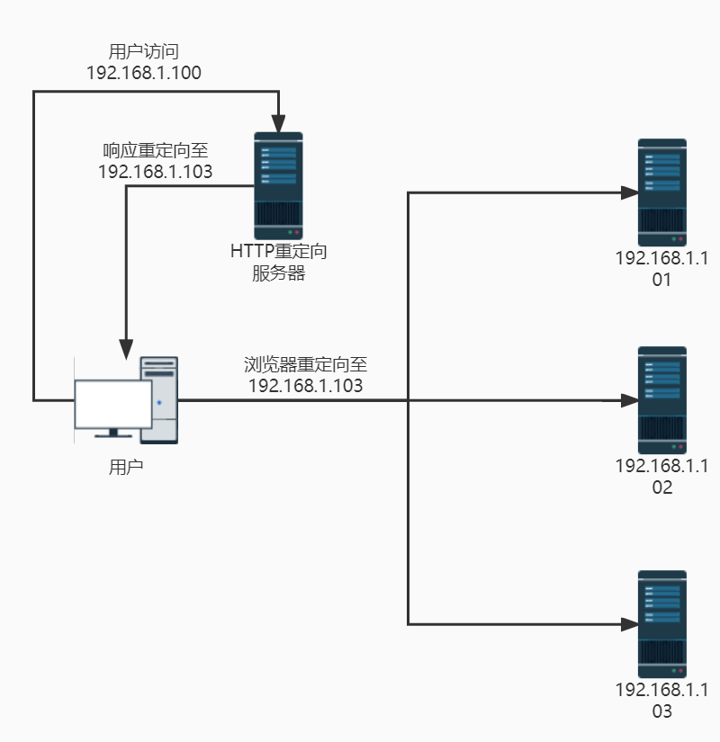

记录一下hexo的施工过程。主要参考K大的这篇[基于 Hexo 的全自动博客构建部署系统 ](https://kchen.cc/2016/11/12/hexo-instructions/#什么是-Hexo)，我再稍微补充一些自己遇到的坑。

<!--more-->

# 施工进度

- [x] smms上传限制5M图片，如果图片大于5M需要对图片进行压缩
- [ ] action缓存，构建加速
- [ ] ~~dns负载均衡~~（暂时没有第二个服务器）
- [x] 评论模块
- [x] 归档页

# 新建文章

在hexo根目录下，终端输入`hexo new [layout] [title]`

| Layout         | Path           |
| -------------- | -------------- |
| post (default) | source/_posts  |
| draft          | source/_drafts |
| page           | source         |

草稿发布`hexo publish [title]`

# md图床问题

Markdown使用图床很方便，我现在用的图床是SMMS，暂时没多大问题，但前期做好备份还是有备无患。因此，最好的解决方案是先将图片保存到本地目录，写完push至github后，结合Action自动读取md源文件，并将图片链接转换为图床链接，再完成hexo渲染。

python转换代码如下

```python
import argparse
import os
import argparse
import re
import requests
import json


def smms_upload(img):
    # 判断图片是否大于5M
    with open(img, 'rb') as img_file:
        if os.path.getsize(img) < 5 * 1024 * 1024:
            try:
                smms_url = 'https://sm.ms/api/v2/upload'
                response = requests.post(
                    smms_url,
                    files={'smfile': img_file, 'format': 'json'},
                    headers={'Authorization': smms_token}
                )
                print("upload finish")
                img_new_url = json.loads(response.text)
                cloud_path = img_new_url['data']['url']

                return cloud_path
            except BaseException as err:
                print(f"error in upload to smms:{err}")
        else:
            print('err in upload, image size is more than 5M')
            return None


def convert2url(file_path):
    with open(file_path, 'r', encoding='utf-8') as f:
        lines = f.readlines()

    outs = []
    for line in lines:
        if re.search('\!\[.*\)', line) is not None:
            images_offline = re.findall('\!\[.*\)', line)  # 找到每段中所有的图片本地链接
            for item in images_offline:
                # 对每个链接进行替换
                img_path = re.search('(?<=\()(.+?)(?=\))', item).group()
                # 判断图片路径是否为网络路径
                if re.search('[a-zA-z]+://[^\s]*', img_path) is None:
                    img_file = os.path.join(path_md, img_path)
                    images_online = smms_upload(img_file)
                    if images_online is not None:
                        line = line.replace(img_path, images_online)
                        outs.append(line)
        else:
            outs.append(line)

    with open(file_path, 'w', encoding='utf-8') as f:
        f.writelines(outs)

if __name__ == "__main__":
    ap = argparse.ArgumentParser()
    ap.add_argument("-p", "--path", help="the path of your post file")
    ap.add_argument("-t", "--token", help="the token of your smms count")

    args = ap.parse_args()
    path_md = args.path
    smms_token = args.token

    md_list = os.listdir(path_md)
    md_list = [item for item in md_list if item.endswith('md')]
    for item in md_list:
        file_path = os.path.join(path_md, item)
        convert2url(file_path)

```


# Github Action自动部署

每次部署在本地hexo g -d，只是在本地构建文件再提交，github只充当了一个静态服务器的作用，没有起到git的作用，因此使用Github Action可以实现自动化部署，且可以实现图床链接的替换。

在`.github`目录下新建文件夹`.workflows`，再新建文件`deployment.yml`，代码如下：

```yaml
name: Hexo Auto-Deploy
on: [push]

jobs:
  repalce_image:
    name: md images replace
    runs-on: ubuntu-latest

    steps:
      - name: 1. git checkout
        uses: actions/checkout@v2.4.0

      - name: 2. setup python
        uses: actions/setup-python@v2.3.1
        with:
          python-version: "3.8.x"
          architecture: "x64"

      - name: 3. setup and run
        run: |
          pip install requests
          sudo apt install tree
          tree source/
          python convert_img2url.py -p source/_posts -t "${{ secrets.SMMS_TOKEN }}"

      - name: 4. install hexo...
        run: |
          npm install hexo-cli -g
          npm install
          npm list --depth 0

      - name: 5. hexo generate
        run: |
          hexo clean
          hexo g

      - name: 6. hexo deploy ...
        run: |
          mkdir -p ~/.ssh/
          echo "${{ secrets.ACCESS_TOKEN }}" > ~/.ssh/id_rsa
          chmod 600 ~/.ssh/id_rsa
          ssh-keyscan github.com >> ~/.ssh/known_hosts

          git config --global user.name "zrtty1998"
          git config --global user.email "zrtty1998@gmail.com"
          git config --global core.quotepath false

          hexo d


```

# 负载均衡

## HTTP重定向

HTTP重定向通过一台服务器根据用户的HTTP请求计算出真实服务器地址，将该地址返回到重定向响应中返回给用户。这种负载均衡方案较简单，缺点如下：

- 浏览器需两次请求才能完成一次访问
- 重定向服务器本身可能会成为瓶颈
- HTTP返回码302重定向，可能使搜索引擎判断SEO作弊



## DNS负载均衡

DNS负载均衡是使用DNS服务器对同一域名配置多条A记录，每次域名解析请求都会根据对应的负载均衡算法计算出一个不同的IP地址并返回。其结构类似HTTP负载均衡，只不过将请求步骤交给了DNS服务器。

该方法有如下优点：

- 负载均衡任务交给DNS服务器，较为方便。
- 部署在服务器上的应用不需要任何配置。
- 服务器可以位于互联网任何位置。
- DNS支持基于地理位置的域名解析，即将根据用户所在地理位置，将域名解析成距离最近的一个服务器地址，加速用户访问。

同时该方案也存在如下缺点：

- DNS是多级解析的，每一级都会缓存该条域名的A记录，更新记录生效需要较长时间。
- 不能按照服务器的处理能力来分配负载，DNS负载均衡采用的是简单的轮询算法，因此其负载均衡的效果不太好。
- 为保证DNS数据即时更新，使地址能随机分配，一般需要将DNS刷新时间设置较小，但会导致DNS流量大增造成其他问题。

# 博客美化

## 代码块美化

自带的代码块显示没有高亮，也没有一键复制的功能。因此着手添加这两项功能。

首先注意到hexo已经内部集成了highlight.js和prismjs。

